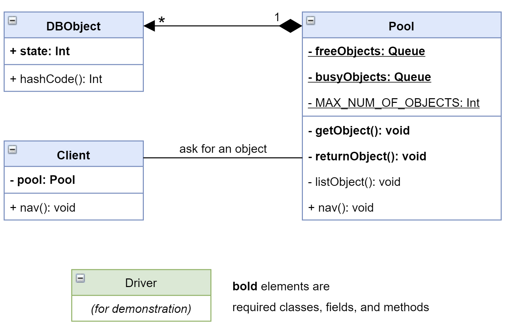

# Object Pool Design Pattern
This repo is an example to demonstrate how the Object Pool Design Pattern works.

### Brief

A **creational** design pattern.

> Reusing the object that are expensive or slow to instantiate.
The pool is a container which contains a specified amount of objects. When an object is taken from the pool, it is not available in the pool until it is put back. Objects in the pool have a lifecycle: creation, validation and destroy.
>
> — Javatpoint.com

### Participants

- Pool: The most important class. It works as a controller to handle clients' requests for reusable objects.
- Objects: The reusable objects that are expensive or slow to instantiate.
- Client: The class that requests to use object(s) in the pool.

### UML Diagram

### References

- https://www.geeksforgeeks.org/object-pool-design-pattern/
- http://www.blackwasp.co.uk/ObjectPool.aspx
- https://www.ard.ninja/blog/when-to-use-object-pooling-in-java/
- https://www.javatpoint.com/object-pool-pattern
- https://www.journaldev.com/18662/kotlin-singleton-companion-object